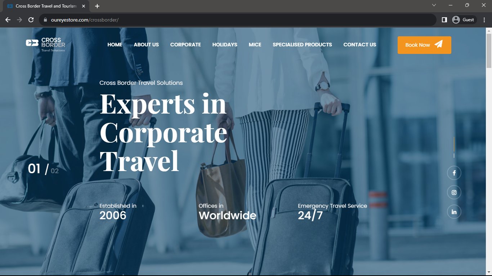
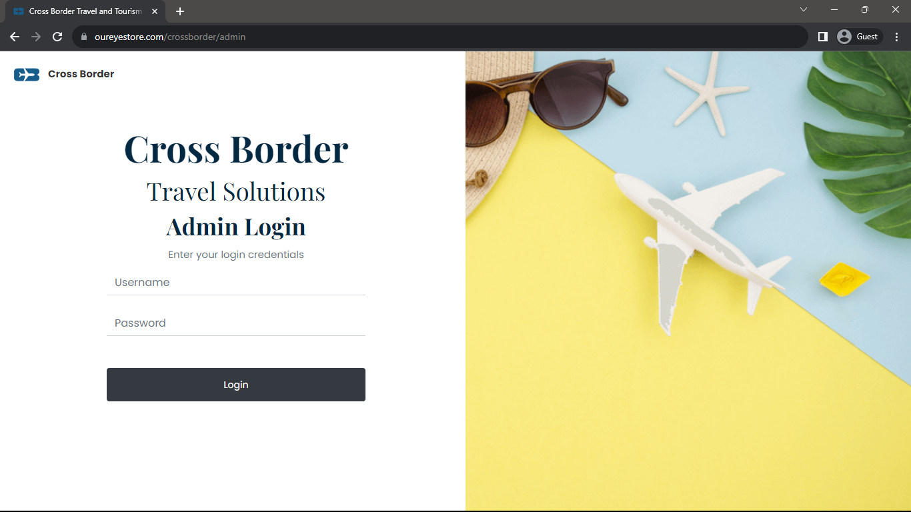
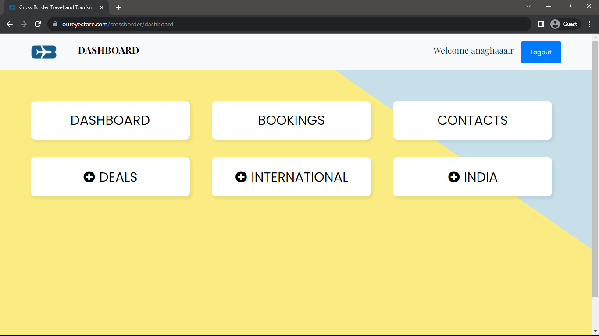
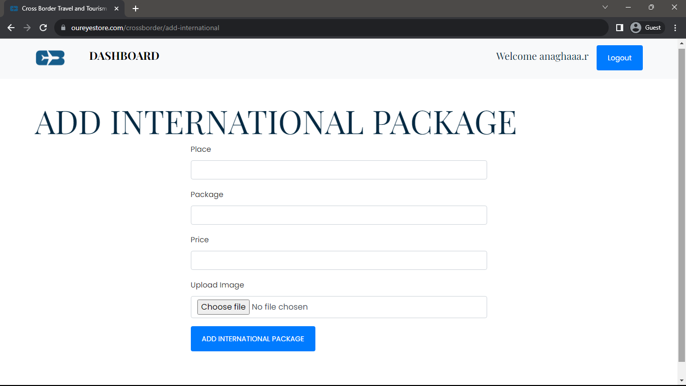

 <h1 align="center">Crossborder Website</h1>

<h3>Project Description</h3>

Developed a dynamic travel and tourism website named "CrossBorder" using the Laravel framework. Implemented a feature-rich admin panel, enabling seamless CRUD operations for managing travel destinations, tour packages, customer testimonials, and other relevant information. Leveraged Laravel's mailing system to enhance communication and engagement, ensuring efficient correspondence with users

